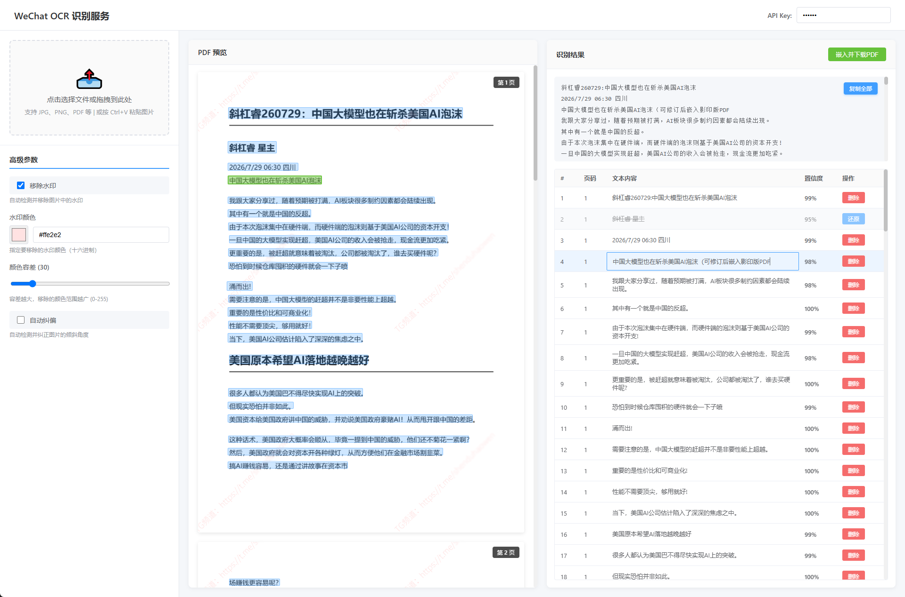

# WeChat OCR API

<div align="center">

[](https://www.docker.com/)
[](https://www.python.org/)
[](LICENSE)

**基于微信 OCR 引擎的智能文字识别服务**

支持图片和 PDF 文件的高精度识别，可将识别结果嵌入生成可搜索 PDF，并提供水印去除、图片纠偏等 OCR 预处理增强功能

[特性](#特性) • [快速开始](#快速开始) • [API文档](#api-文档) • [部署指南](#部署指南)

</div>

---

## 💡 为什么选择这个项目？

与 [ocrmypdf](https://github.com/ocrmypdf/OCRmyPDF) 等传统 OCR 工具相比，本项目的独特优势：

- **🎯 人工干预能力** - 提供 Web 界面，允许用户在线修订 OCR 识别结果后再嵌入 PDF，确保最终文档的准确性
- **⚡ 极低资源占用** - 无需 GPU，在 1核2G 轻量云服务器上即可 Docker 部署运行，5页 PDF 从上传到返回 OCR 结果仅需约 11 秒（完整流程）
- **🎨 可视化编辑** - 实时预览识别结果，支持文本块的编辑、删除、还原等操作
- **🔧 灵活的工作流** - 识别、修订、嵌入三步解耦，适合需要人工校对的场景

**适用场景：** 扫描档案数字化、合同文档 OCR 后人工校对、需要精确文本的法律/财务文档处理

---

## ⚙️ 系统要求

- **CPU：** 需要支持 AVX2 指令集（微信 OCR 核心依赖）
  - 检查方法：`cat /proc/cpuinfo | grep avx2` （有输出即支持）
  - 大多数 2013 年后的 Intel/AMD CPU 都支持 AVX2
- **内存：** 最低 2GB RAM
- **系统：** Linux/Windows/macOS（Docker 部署跨平台支持）

---

## 特性

### 🎯 核心功能

- ✅ **图片 OCR** - 支持 PNG、JPG、BMP、TIFF 等格式
- ✅ **PDF 智能处理** - 自动识别文档类型，选择最优处理策略
  - 纯文本 PDF：直接提取（秒级响应）
  - 扫描 PDF：整页渲染后 OCR
  - 混合 PDF：文本提取 + 图片 OCR
- ✅ **智能文本排版** - 自动识别行、列、段落结构，优化表格和多列布局的文本输出
- ✅ **智能预处理** - 6 种图像预处理算法，科学的工作流顺序
  - **水印去除** - 指定色值或自动检测浅色水印
  - **自动纠偏** - 自动检测并纠正扫描件倾斜
  - **去除噪点** - 3 种去噪算法（中值滤波/非局部均值/双边滤波）
  - **对比度增强** - 自适应直方图均衡化（CLAHE）显著提升识别率
  - **图像二值化** - 转为黑白图像，消除背景干扰（适合扫描件）
  - **图像锐化** - 增强文字边缘，改善模糊图片识别效果
- ✅ **快捷预设** - 智能预设、扫描件优化、照片优化一键应用
- ✅ **并发控制** - 限流机制保护服务稳定性
- ✅ **RESTful API** - 标准 HTTP 接口，易于集成
- ✅ **API 认证** - 可选的 Bearer Token 认证机制

### 🎨 Web 界面

- ✅ **可视化交互** - 现代化 Web UI，支持拖拽/粘贴上传
- ✅ **实时预览** - 图片/PDF 预览，文本块可视化标注
- ✅ **文本编辑** - 支持对识别结果进行在线修订
- ✅ **智能管理** - 文本块删除/还原，逻辑删除标记
- ✅ **PDF 嵌入** - 将修订后的文本嵌入原文件，生成可搜索 PDF
- ✅ **高级参数** - 6 种预处理选项可视化配置，参数实时调节
- ✅ **快捷预设** - 智能预设/扫描件优化/照片优化，一键应用最佳配置

### 🚀 技术亮点

- **智能策略选择** - 根据页面结构自动选择处理方式（文本提取 vs OCR）
- **高性能处理** - PyMuPDF + OpenCV 优化，单页处理 < 5秒
- **容器化部署** - Docker 一键启动，跨平台支持
- **模块化设计** - 清晰的代码结构，易于扩展和维护
- **完整的错误处理** - 统一的错误响应格式和日志记录
- **交互式 Web UI** - Vue 3 + PDF.js 实现的现代化界面
- **文本层嵌入** - 生成带隐藏文本层的可搜索 PDF
- **智能文件管理** - 自动清理临时文件，保留最近 30 个

---

## 快速开始

### 方式一：Docker（推荐）

```bash
# 1. 拉取镜像
docker pull icheerme/wxocr

# 2. 运行容器
docker run -d -p 5000:5000 --name wxocr icheerme/wxocr

# 3. 访问 Web 界面
# 浏览器打开: http://localhost:5000

# 4. 测试 API
curl http://localhost:5000/api/health
```

### 方式二：本地运行

```bash
# 1. 克隆项目
git clone https://github.com/icheer/wxocr.git
cd wxocr

# 2. 安装依赖
pip install -r requirements.txt

# 3. 启动服务
python app.py

# 4. 访问服务
# Web 界面: http://localhost:5000
# API 端点: http://localhost:5000/api/ocr
```

### Web 界面使用

1. **上传文件** - 点击虚线框、拖拽文件或 Ctrl+V 粘贴
2. **配置参数** - 选择预处理选项：
   - 水印去除、自动纠偏
   - 去除噪点、对比度增强（推荐）
   - 图像二值化（推荐）、图像锐化
   - 或使用**快捷预设**一键应用最佳配置
3. **查看结果** - 左侧预览原文件，右侧显示识别结果
4. **编辑文本** - 点击表格中的文本进行修订
5. **管理内容** - 删除/还原不需要的文本块
6. **导出 PDF** - 点击"嵌入并下载PDF"生成可搜索文档

---

## 使用示例

### Web 界面

访问 `http://localhost:5000` 使用可视化界面：



**功能演示：**
- 📤 **上传文件** - 支持点击、拖拽、粘贴（Ctrl+V）三种方式
- 🎨 **可视化预览** - 图片/PDF 预览，蓝色框标注文本块
- ✏️ **在线编辑** - 点击文本块直接修改内容
- 🗑️ **智能管理** - 删除不需要的文本块（逻辑删除，可还原）
- 📄 **生成 PDF** - 将修订后的文本嵌入原文件，生成可搜索 PDF

### API 调用

#### 基本图片识别

```bash
curl -X POST http://localhost:5000/api/ocr \
  -F "file=@image.png"
```

#### PDF 文档识别

```bash
curl -X POST http://localhost:5000/api/ocr \
  -F "file=@document.pdf"
```

#### 去除水印

```bash
curl -X POST http://localhost:5000/api/ocr \
  -F "file=@watermarked.pdf" \
  -F "remove_watermark=true" \
  -F "watermark_color=#ffd9d9"
```

#### 纠正倾斜

```bash
curl -X POST http://localhost:5000/api/ocr \
  -F "file=@skewed.jpg" \
  -F "deskew=true"
```

#### 智能预处理（推荐）

```bash
# 对比度增强 + 二值化（显著提升识别率）
curl -X POST http://localhost:5000/api/ocr \
  -F "file=@scan.jpg" \
  -F "enhance_contrast=true" \
  -F "binarize=true"
```

#### 扫描件优化（完整预处理链）

```bash
# 纠偏 + 去噪 + 对比度增强 + 二值化
curl -X POST http://localhost:5000/api/ocr \
  -F "file=@old_scan.pdf" \
  -F "deskew=true" \
  -F "denoise=true" \
  -F "denoise_method=median" \
  -F "enhance_contrast=true" \
  -F "contrast_method=clahe" \
  -F "binarize=true" \
  -F "binarize_method=gaussian"
```

#### 模糊照片优化

```bash
# 去噪 + 对比度增强 + 锐化（保留颜色）
curl -X POST http://localhost:5000/api/ocr \
  -F "file=@blurry_photo.jpg" \
  -F "denoise=true" \
  -F "denoise_method=fastNlMeans" \
  -F "enhance_contrast=true" \
  -F "sharpen=true" \
  -F "sharpen_strength=1.5"
```

#### 带认证的请求

```bash
# 设置环境变量
export API_KEY=your_secret_key

# 启动服务后，需要在请求中携带 Bearer Token
curl -X POST http://localhost:5000/api/ocr \
  -H "Authorization: Bearer your_secret_key" \
  -F "file=@image.png"
```

#### 嵌入文本生成 PDF

```bash
curl -X POST http://localhost:5000/api/embed \
  -H "Content-Type: application/json" \
  -H "Authorization: Bearer your_secret_key" \
  -d '{
    "file_path": "temp/xxx.png",
    "file_type": "image",
    "ocr_response": [
      {
        "text": "修订后的文本",
        "rate": 0.95,
        "left": 10.0,
        "top": 20.0,
        "right": 200.0,
        "bottom": 50.0
      }
    ]
  }' \
  --output embedded.pdf
```

### Python 客户端

```python
import requests

def ocr_file(file_path, api_key=None):
    url = 'http://localhost:5000/api/ocr'
    headers = {}
    if api_key:
        headers['Authorization'] = f'Bearer {api_key}'
    
    with open(file_path, 'rb') as f:
        response = requests.post(url, files={'file': f}, headers=headers)
    
    result = response.json()
    if result['success']:
        return result['data']
    else:
        raise Exception(result.get('message', 'OCR failed'))

def embed_text_to_pdf(file_path, file_type, ocr_data, api_key=None):
    """将编辑后的文本嵌入到文件中生成 PDF"""
    url = 'http://localhost:5000/api/embed'
    headers = {'Content-Type': 'application/json'}
    if api_key:
        headers['Authorization'] = f'Bearer {api_key}'
    
    payload = {
        'file_path': file_path,
        'file_type': file_type,
        'ocr_response': ocr_data if file_type == 'image' else None,
        'pages': ocr_data if file_type == 'pdf' else None
    }
    
    response = requests.post(url, json=payload, headers=headers)
    
    if response.status_code == 200:
        with open('output.pdf', 'wb') as f:
            f.write(response.content)
        return 'output.pdf'
    else:
        raise Exception(response.json().get('message', 'Embed failed'))

# 使用示例
data = ocr_file('document.pdf')
print(data['text'])

# 编辑文本后嵌入生成 PDF
embedded_pdf = embed_text_to_pdf(
    file_path=data['pdf_path'],
    file_type='pdf',
    ocr_data=data['pages']
)
print(f'生成的 PDF: {embedded_pdf}')
```

---

## API 文档

### 端点

| 方法 | 路径 | 说明 |
|------|------|------|
| GET | `/` | Web 界面主页 |
| GET | `/api/health` | 健康检查 |
| POST | `/api/ocr` | OCR 识别 |
| POST | `/api/smart-format` | 智能文本排版（将 OCR 结果智能排版为易读格式） |
| POST | `/api/embed` | 嵌入文本生成 PDF |
| POST | `/api/ocr-and-embed` | 一站式 OCR + 嵌入（直接生成可搜索PDF） |
| GET | `/api/temp/<filename>` | 获取临时文件（预处理图片预览，支持 query 参数鉴权） |
| GET | `/api/logs` | 查看服务端日志（需认证） |

### 认证

API 支持可选的 Bearer Token 认证：

```bash
# 设置环境变量启用认证
export API_KEY=your_secret_key

# 请求时携带 Authorization 头
curl -H "Authorization: Bearer your_secret_key" ...
```

**注意**：如果未设置 `API_KEY` 环境变量，则认证功能不启用，所有请求都可以直接访问。

### OCR 接口参数

| 参数 | 类型 | 必填 | 说明 |
|------|------|------|------|
| `file` | File | ✅ | 图片或 PDF 文件 |
| `remove_watermark` | Boolean | ❌ | 是否去除水印 |
| `watermark_color` | String | ❌ | 水印颜色（#RRGGBB） |
| `watermark_tolerance` | Integer | ❌ | 颜色容差（0-255，默认40） |
| `deskew` | Boolean | ❌ | 是否纠正倾斜 |
| `denoise` | Boolean | ❌ | 是否去除噪点 |
| `denoise_method` | String | ❌ | 去噪方法（median/fastNlMeans/bilateral，默认median） |
| `enhance_contrast` | Boolean | ❌ | 是否增强对比度（推荐） |
| `contrast_method` | String | ❌ | 对比度增强方法（clahe/histogram，默认clahe） |
| `binarize` | Boolean | ❌ | 是否二值化（推荐） |
| `binarize_method` | String | ❌ | 二值化方法（gaussian/otsu，默认gaussian） |
| `sharpen` | Boolean | ❌ | 是否锐化（与二值化互斥） |
| `sharpen_strength` | Float | ❌ | 锐化强度（0.5-2.0，默认1.0） |
| `output_format` | String | ❌ | 输出格式（plain/structured） |

**预处理顺序**：水印去除 → 纠偏 → 去噪 → 对比度增强 → 二值化 → 锐化（如果未二值化）

**推荐组合**：
- **扫描件**：`enhance_contrast=true` + `binarize=true`（识别率提升最显著）
- **老旧文档**：`deskew=true` + `denoise=true` + `enhance_contrast=true` + `binarize=true`
- **模糊照片**：`denoise=true` + `enhance_contrast=true` + `sharpen=true`

### Embed 接口参数

| 参数 | 类型 | 必填 | 说明 |
|------|------|------|------|
| `file_path` | String | ✅ | 临时文件路径（来自 OCR 响应） |
| `file_type` | String | ✅ | 文件类型（image/pdf） |
| `ocr_response` | Array | 条件 | 图片模式时必填，文本块数组 |
| `pages` | Array | 条件 | PDF 模式时必填，页面数据数组 |
| `apply_preprocessing` | Boolean | ❌ | 是否使用预处理后的版本（去水印/纠偏后），默认 false。图片模式直接使用预处理图片；PDF模式使用预处理后的页面图片重建PDF |

### 智能排版接口

**端点**: `POST /api/smart-format`

**认证**: 需要 Bearer Token（如已配置 `API_KEY`）

**功能**: 将 OCR 识别结果智能排版为易读的文本格式。自动识别行、列、段落结构，适合处理包含表格或多列布局的文档。

**适用场景**: 
- 包含表格的扫描文档（如财务报表、数据表格）
- 多列布局的文档（如报纸、杂志）
- 需要保持原始排版结构的文档

**请求参数**:

| 参数 | 类型 | 必填 | 说明 |
|------|------|------|------|
| `ocr_response` | Array | ✅ | OCR 识别结果数组（包含 text, left, top, right, bottom, rate 字段） |
| `options` | Object | ❌ | 可选参数配置 |

**options 参数说明**:

| 参数 | 类型 | 默认值 | 说明 |
|------|------|--------|------|
| `row_threshold_ratio` | Float | 0.5 | 行聚合阈值系数（用于判断文本块是否属于同一行） |
| `gap_threshold_ratio` | Float | 1.2 | 列间距判断系数（间距大于中位间距×该系数时识别为列分隔）<br>**调整建议**：表格列较密集时可降低到 1.0-1.1，列较稀疏时可提高到 1.3-1.5 |
| `paragraph_spacing_ratio` | Float | 1.5 | 段落间距判断系数（用于插入空行分隔段落） |
| `min_confidence` | Float | 0.3 | 最低置信度阈值（过滤低置信度文本块） |
| `column_separator` | String | `"    "` | 列分隔符（默认4个空格，也可使用 `" \| "` 等） |

**请求示例**:

```bash
curl -X POST http://localhost:5000/api/smart-format \
  -H "Authorization: Bearer your_secret_key" \
  -H "Content-Type: application/json" \
  -d '{
    "ocr_response": [
      {"text": "姓名", "left": 10, "top": 10, "right": 50, "bottom": 30, "rate": 0.98},
      {"text": "张三", "left": 200, "top": 10, "right": 240, "bottom": 30, "rate": 0.95}
    ],
    "options": {
      "gap_threshold_ratio": 1.2,
      "column_separator": "    "
    }
  }'
```

**响应示例**:

```json
{
  "success": true,
  "data": {
    "formatted_text": "姓名    张三\n年龄    25\n地址    北京市\n\n备注：以上信息仅供参考",
    "metadata": {
      "row_count": 5,
      "column_count": 2,
      "paragraph_count": 2,
      "filtered_blocks": 1
    }
  }
}
```

**响应字段说明**:

- `formatted_text`: 格式化后的文本，列之间用指定分隔符连接，段落之间用空行分隔
- `metadata.row_count`: 识别到的行数
- `metadata.column_count`: 识别到的最大列数
- `metadata.paragraph_count`: 识别到的段落数
- `metadata.filtered_blocks`: 被过滤的低置信度文本块数量

**使用提示**:

1. **表格识别优化**: 如果表格列间距识别不准确，可调整 `gap_threshold_ratio` 参数：
   - 列分隔过多（正常文字被拆分）：增大该值（如 1.3-1.5）
   - 列分隔过少（多列被合并）：减小该值（如 1.0-1.1）
   
2. **Web 界面集成**: 前端已集成"智能排版并复制"按钮，自动调用该接口并复制格式化文本

3. **与 OCR 接口配合使用**: 先调用 `/api/ocr` 获取 `ocr_response`，再调用 `/api/smart-format` 进行智能排版

### OCR-and-Embed 一站式接口

**端点**: `POST /api/ocr-and-embed`

**认证**: 需要 Bearer Token（如已配置 `API_KEY`）

**功能**: 直接从图片或影印版PDF生成带嵌入文本的PDF（OCR识别 + 文本嵌入一步完成）

**适用场景**: 对扫描质量和OCR识别结果有信心，希望一步到位获得可搜索PDF的场景

**支持格式**: PDF 和图片文件（jpg, png, bmp 等）

**参数说明**:

| 参数 | 类型 | 必填 | 说明 |
|------|------|------|------|
| `file` | File | ✅ | 图片或 PDF 文件 |
| `remove_watermark` | Boolean | ❌ | 是否去除水印（OCR预处理） |
| `watermark_color` | String | ❌ | 水印颜色（#RRGGBB） |
| `watermark_tolerance` | Integer | ❌ | 颜色容差（0-255，默认40） |
| `deskew` | Boolean | ❌ | 是否纠正倾斜 |
| `apply_preprocessing` | Boolean | ❌ | 是否在最终PDF中应用预处理效果（去水印/纠偏），默认 false。启用后图片使用预处理版本，PDF强制渲染所有页面并使用预处理后的图片重建 |

**请求示例（PDF）**:
```bash
curl -X POST http://localhost:5000/api/ocr-and-embed \
  -H "Authorization: Bearer your_secret_key" \
  -F "file=@document.pdf" \
  -F "deskew=true" \
  --output embedded_result.pdf
```

**请求示例（图片 - 仅优化OCR识别）**:
```bash
curl -X POST http://localhost:5000/api/ocr-and-embed \
  -H "Authorization: Bearer your_secret_key" \
  -F "file=@scan.jpg" \
  -F "remove_watermark=true" \
  --output embedded_result.pdf
```

**请求示例（图片 - 最终输出也去除水印）**:
```bash
curl -X POST http://localhost:5000/api/ocr-and-embed \
  -H "Authorization: Bearer your_secret_key" \
  -F "file=@scan.jpg" \
  -F "remove_watermark=true" \
  -F "apply_preprocessing=true" \
  --output embedded_result_no_watermark.pdf
```

**支持的参数**: 与 OCR 接口相同（`remove_watermark`、`watermark_color`、`watermark_tolerance`、`deskew` 等）

**响应**: 直接返回嵌入文本后的PDF文件（`application/pdf`）

**错误响应示例**:
```json
{
  "success": false,
  "error": {
    "code": "INVALID_FILE_TYPE",
    "message": "不支持的文件类型，仅支持PDF和图片文件"
  }
}
```

### Logs 接口说明

**端点**: `GET /api/logs`

**认证**: 必须配置 `API_KEY` 环境变量并携带 Bearer Token

**功能**: 获取服务端日志最新100行（用于调试和监控）

**请求示例**:
```bash
curl -X GET http://localhost:5000/api/logs \
  -H "Authorization: Bearer your_secret_key"
```

**响应示例**:
```json
{
  "success": true,
  "data": {
    "logs": [
      "2026-07-30 12:00:00 - INFO - 收到OCR请求",
      "2026-07-30 12:00:01 - INFO - OCR识别完成"
    ],
    "total_lines": 100,
    "log_file": "/path/to/logs/app.log"
  }
}
```

**错误响应**（未配置API_KEY）:
```json
{
  "success": false,
  "error": {
    "code": "LOGS_DISABLED",
    "message": "日志查看功能未启用（需要配置API_KEY环境变量）"
  }
}
```

### Temp 文件访问接口

**端点**: `GET /api/temp/<filename>`

**认证**: 可选的 query 参数鉴权（如已配置 `API_KEY`）

**功能**: 获取临时文件（用于预览预处理后的图片）

**适用场景**: Web 界面预览去水印/纠偏后的图片效果

**安全特性**: 
- 路径遍历保护（只能访问 TEMP_DIR 内的文件）
- 支持 query 参数鉴权：`?api_key=xxx`
- 自动设置正确的 MIME 类型

**请求示例**:
```bash
# 无认证
curl http://localhost:5000/api/temp/page_1_full.png_processed.png

# 带认证（如果配置了 API_KEY）
curl "http://localhost:5000/api/temp/page_1_full.png_processed.png?api_key=your_secret_key"
```

**支持的文件类型**: PNG, JPG, JPEG, GIF, BMP, WebP, PDF

**错误响应示例**:
```json
{
  "success": false,
  "error": {
    "code": "FILE_NOT_FOUND",
    "message": "文件不存在或已过期"
  }
}
```

**使用说明**: 
- 当 OCR 时启用了水印去除或图片纠偏，响应中会包含预处理图片的路径
- Web 界面会自动使用此接口显示预处理后的效果
- 临时文件会根据 `TEMP_FILE_RETENTION` 配置自动清理（默认保留 200 个）

### 响应格式

#### OCR 接口响应（图片）

```json
{
  "success": true,
  "data": {
    "text": "识别到的文本内容...",
    "width": 1920,
    "height": 1080,
    "image_path": "temp/xxx.png",
    "ocr_response": [
      {
        "text": "文本块内容",
        "rate": 0.95,
        "left": 10.0,
        "top": 20.0,
        "right": 200.0,
        "bottom": 50.0
      }
    ],
    "metadata": {
      "file_type": "image",
      "page_count": 1,
      "processing_method": "full_page_render",
      "preprocessed": {
        "watermark_removed": false,
        "deskewed": false,
        "denoised": false,
        "contrast_enhanced": true,
        "binarized": true,
        "sharpened": false
      },
      "processing_time_ms": 3240
    }
  }
}
```

#### OCR 接口响应（PDF）

```json
{
  "success": true,
  "data": {
    "text": "完整文本内容...",
    "pdf_path": "temp/xxx.pdf",
    "pages": [
      {
        "page_number": 1,
        "width": 595.0,
        "height": 842.0,
        "text": "第一页文本",
        "strategy": "text_extraction",
        "ocr_response": [
          {
            "text": "文本块",
            "rate": 0.98,
            "left": 50.0,
            "top": 100.0,
            "right": 300.0,
            "bottom": 150.0
          }
        ]
      }
    ],
    "metadata": {
      "file_type": "pdf",
      "page_count": 5,
      "processing_method": "mixed",
      "preprocessed": {
        "watermark_removed": true,
        "deskewed": false,
        "denoised": true,
        "contrast_enhanced": true,
        "binarized": true,
        "sharpened": false
      },
      "processing_time_ms": 8560
    }
  }
}
```

#### Embed 接口响应

返回 PDF 文件（二进制流），Content-Type 为 `application/pdf`

**完整文档**: [docs/api-spec.md](docs/api-spec.md)

---

## 部署指南

### Docker 部署

#### 1. 构建镜像

```bash
docker build -t wxocr:latest .
```

#### 2. 运行容器

```bash
docker run -d \
  --name wxocr \
  -p 5000:5000 \
  -e MAX_CONCURRENT_TASKS=5 \
  -e MAX_FILE_SIZE_MB=50 \
  -e LOG_LEVEL=INFO \
  wxocr:latest
```

#### 3. 查看日志

```bash
docker logs -f wxocr
```

#### 4. 进入容器

```bash
docker exec -it wxocr bash
```

### Docker Compose

```yaml
version: '3.8'

services:
  wxocr:
    image: golangboyme/wxocr:latest
    container_name: wxocr
    ports:
      - "5000:5000"
    environment:
      - MAX_CONCURRENT_TASKS=5
      - MAX_FILE_SIZE_MB=50
      - LOG_LEVEL=INFO
    volumes:
      - ./temp:/app/temp
      - ./logs:/app/logs
    restart: unless-stopped
```

启动：
```bash
docker-compose up -d
```

---

## 配置说明

### 环境变量

| 变量 | 默认值 | 说明 |
|------|--------|------|
| `HOST` | 0.0.0.0 | 服务监听地址 |
| `PORT` | 5000 | 服务端口 |
| `API_KEY` | 无 | API 认证密钥（可选，不设置则不启用认证） |
| `MAX_FILE_SIZE_MB` | 20 | 最大文件大小（MB） |
| `MAX_PDF_PAGES` | 50 | PDF 最大页数 |
| `MAX_CONCURRENT_TASKS` | 3 | 最大并发任务数 |
| `TEMP_DIR` | ./temp | 临时文件目录 |
| `TEMP_FILE_RETENTION` | 200 | 保留的临时文件数量 |
| `LOG_LEVEL` | INFO | 日志级别 |
| `WATERMARK_TOLERANCE` | 40 | 默认水印容差 |
| `DESKEW_THRESHOLD` | 1.0 | 纠偏角度阈值（度） |
| `PDF_RENDER_SCALE` | 2.0 | PDF 渲染缩放倍数 |

### 配置示例

```bash
# 开发环境
export LOG_LEVEL=DEBUG
export MAX_CONCURRENT_TASKS=2
python app.py

# 生产环境（带认证）
export API_KEY=your_secure_secret_key_here
export LOG_LEVEL=WARNING
export MAX_CONCURRENT_TASKS=10
export MAX_FILE_SIZE_MB=50
export TEMP_FILE_RETENTION=500
python app.py
```

---

## 项目结构

```
wxocr/
├── api/                    # API 路由和验证
│   ├── routes.py          # 路由定义（OCR + Embed）
│   ├── validators.py      # 参数验证
│   ├── auth.py            # API 认证
│   └── error_handlers.py  # 错误处理
├── services/              # 服务层
│   ├── pdf_processor.py   # PDF 处理
│   ├── pdf_embedder.py    # PDF 文本嵌入
│   ├── image_processor.py # 图片预处理
│   ├── ocr_service.py     # OCR 服务
│   └── task_manager.py    # 任务管理
├── static/                # Web 前端资源
│   ├── index.html         # Web UI 主页
│   └── app.js             # Vue 3 应用逻辑
├── utils/                 # 工具函数
│   ├── watermark_remover.py  # 水印去除
│   ├── deskew_helper.py      # 图片纠偏
│   └── logger.py             # 日志系统
├── config/                # 配置管理
│   └── settings.py        # 应用配置
├── docs/                  # 文档
│   ├── api-spec.md        # API 规范
│   ├── implementation-plan.md  # 实施计划
│   └── windows-testing-guide.md # 测试指南
├── wx/                    # 微信 OCR 运行时
├── app.py                 # 应用入口（新版）
├── main.py                # 应用入口（旧版，兼容）
├── Dockerfile             # Docker 构建文件
├── docker-compose.yml     # Docker Compose 配置
├── requirements.txt       # Python 依赖
└── README.md             # 项目说明
```

---

## 技术栈

### 后端
- **Web 框架**: Flask 3.0+
- **PDF 处理**: PyMuPDF 1.23+
- **PDF 生成**: ReportLab 4.0+ / PyPDF2 3.0+
- **图像处理**: OpenCV 4.8+ (headless)
- **数组计算**: NumPy 1.24+
- **图片纠偏**: deskew 1.5+ / scikit-image 0.21+
- **OCR 引擎**: WeChat OCR (wcocr)
- **容器化**: Docker

### 前端
- **框架**: Vue 3.4+ (CDN)
- **PDF 渲染**: PDF.js 3.11+
- **通知提示**: Toastify.js 1.12+
- **样式**: 原生 CSS (Grid + Flexbox)

---

## 性能指标

| 文件类型 | 页数/尺寸 | 预处理 | 处理时间 |
|----------|-----------|--------|----------|
| 纯文本 PDF | 10页 | 无 | < 1秒 |
| 扫描 PDF | 1页 | 无 | 3-5秒 |
| 扫描 PDF | 10页 | 无 | 30-50秒 |
| 图片 | 1920x1080 | 无 | 2-4秒 |
| 图片 | 1920x1080 | 水印+纠偏 | 4-6秒 |

**并发能力**: 默认 3 个并发任务（可配置）

---

## 开发指南

### 本地开发

```bash
# 1. 安装依赖
pip install -r requirements.txt

# 2. 运行测试
python test_phase1.py        # Phase 1 基础架构测试
python test_integration.py   # 集成测试

# 3. 启动开发服务器
export DEBUG=true
export LOG_LEVEL=DEBUG
python app.py
```

### 测试

```bash
# Windows
powershell -ExecutionPolicy Bypass -File docker-test.ps1

# Linux/Mac
bash docker-test.sh
```

### 代码规范

- 遵循 PEP 8 编码规范
- 使用类型注解（Type Hints）
- 编写文档字符串（Docstrings）
- 添加单元测试

---

## 常见问题

### Q: 支持哪些语言？

A: 主要支持中文和英文，依赖微信 OCR 引擎的语言能力。

### Q: 为什么 PDF 处理很快？

A: 对于纯文本 PDF，服务会直接提取文本而非 OCR，速度极快。

### Q: 如何提高识别准确率？

A: 
- 使用高分辨率图片（推荐 300 DPI）
- 启用水印去除功能
- 启用图片纠偏功能
- 确保文字清晰、对比度高

### Q: 返回 429 错误怎么办？

A: 服务器繁忙，请稍后重试。可以增加 `MAX_CONCURRENT_TASKS` 配置。

### Q: Windows 本地测试为什么返回模拟数据？

A: wcocr 是 Linux 程序，在 Windows 上会进入测试模式。实际 OCR 功能需要在 Docker 中测试。

### Q: Web 界面可以编辑识别结果吗？

A: 可以！点击表格中的文本块即可直接编辑。编辑后可以点击"嵌入并下载PDF"生成包含修订文本的可搜索 PDF。

### Q: 什么是"文本嵌入"功能？

A: 将识别到的文本以不可见文本层的形式嵌入到原始图片或PDF中，生成可搜索、可复制的PDF文档，同时保留原始视觉效果。

### Q: 临时文件会自动清理吗？

A: 会的。系统会保留最近 30 个临时文件（可通过 `TEMP_FILE_RETENTION` 配置），超过数量的旧文件会自动删除。

### Q: 如何启用 API 认证？

A: 设置环境变量 `API_KEY=your_secret_key`，启动服务后，所有 API 请求需要在 Header 中携带 `Authorization: Bearer your_secret_key`。Web 界面会提示输入 API Key。

### Q: 为什么提示"临时文件已过期"？

A: OCR 识别后的临时文件有数量限制（默认保留 30 个），超过限制的旧文件会被自动清理。如果您在识别后等待时间过长，或者系统处理了大量其他文件，临时文件可能已被清理。请重新上传文件进行 OCR 识别。

---

## 贡献指南

欢迎贡献代码！请遵循以下步骤：

1. Fork 本仓库
2. 创建特性分支 (`git checkout -b feature/AmazingFeature`)
3. 提交更改 (`git commit -m 'Add some AmazingFeature'`)
4. 推送到分支 (`git push origin feature/AmazingFeature`)
5. 开启 Pull Request

---

## 许可证

本项目采用 MIT 许可证 - 详见 [LICENSE](LICENSE) 文件

---

## 致谢

本项目基于以下开源项目：

- [wxocr](https://github.com/golangboy/wxocr) - 原版微信 OCR 引擎封装，本项目在此基础上二次开发
- [wechat-ocr](https://github.com/swigger/wechat-ocr) - 微信 OCR 调用演示
- [PyMuPDF](https://github.com/pymupdf/PyMuPDF) - PDF 处理库
- [OpenCV](https://github.com/opencv/opencv-python) - 图像处理库

---

## 社区支持

- 学AI上L站！ https://linux.do/

---

## 免责声明

⚠️ **本项目仅供学习和研究使用，请勿用于商业用途。**

使用者应自行承担使用本软件的任何后果。如果您认为本项目侵犯了您的权利，请立即联系仓库所有者，我们将及时处理。

---

<div align="center">

**如果这个项目对你有帮助，请给个 ⭐️ Star 支持一下！**

[报告问题](https://github.com/icheer/wxocr/issues) • [功能建议](https://github.com/icheer/wxocr/issues)

</div>
